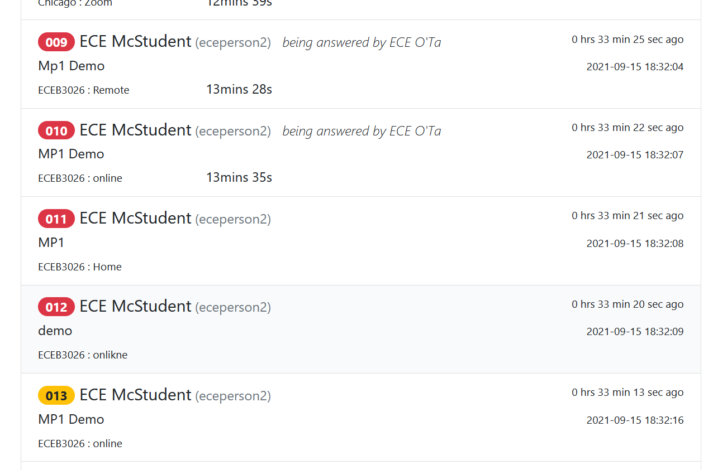

## Slightly Better ECE391 Queue



### Description

A (hacky) TamperMonkey script to improve the ECE391 website queue experience for students.

Current Features:

* Adds queue numbers to entries in the question queue.
* Automatically updates numbers upon queue modifications.
* Automatically scroll to your position if you are in the queue, and automatically scroll as your queue position changes **(non-Safari ONLY!!!)**.
* Queue number highlighting based off of position (red if queue position < # TAs online, yellow if queue position < 2 * # TAs online, grey if otherwise).
* Suppress the TA-directed notification that "a student is waiting for your help", and replaces it with a notification that alerts you when your queue counter is red (that is, when you're just about to be dequeued).

### Installation

1. Instal [Tampermonkey](https://www.tampermonkey.net/) in your browser.
2. [Click Me](https://github.com/sahansk2/slightly-better-ece391-webqueue/raw/main/slightlybetterece391queue.tamper.js)

## Bug Reports

Note, the course staff might update the site and break this script unintentionally (or intentionally), but that's totally OK.
Create an issue or bug report if there's some kind of a problem and we can work through it together.

Either email me at sahansk2+fixme@illinois.edu (please respect the plus addressing), make an issue on GitHub, or contact me on Discord. Due to certain classes (*ahem*), progress here might be slow.

## License

GPLv2. In a nutshell, you can fork/download/do what you want with the stuff I make here, but if you give the improved Tampermonkey script to anybody you _must_ share the improved Tampermonkey script source code with them too (no minified garbage!) and preserve license notices. If you improve it and keep the improvements to yourself only, then you're not obliged to give the source code to anybody except yourself.

```
Copyright (C) 2021 Sahan Kumarasinghe

This program is free software; you can redistribute it and/or
modify it under the terms of the GNU General Public License
as published by the Free Software Foundation; either version 2
of the License, or (at your option) any later version.

This program is distributed in the hope that it will be useful,
but WITHOUT ANY WARRANTY; without even the implied warranty of
MERCHANTABILITY or FITNESS FOR A PARTICULAR PURPOSE.  See the
GNU General Public License for more details.

You should have received a copy of the GNU General Public License
along with this program; if not, write to the Free Software
Foundation, Inc., 51 Franklin Street, Fifth Floor, Boston, MA  02110-1301, USA.
```

<hr/>


